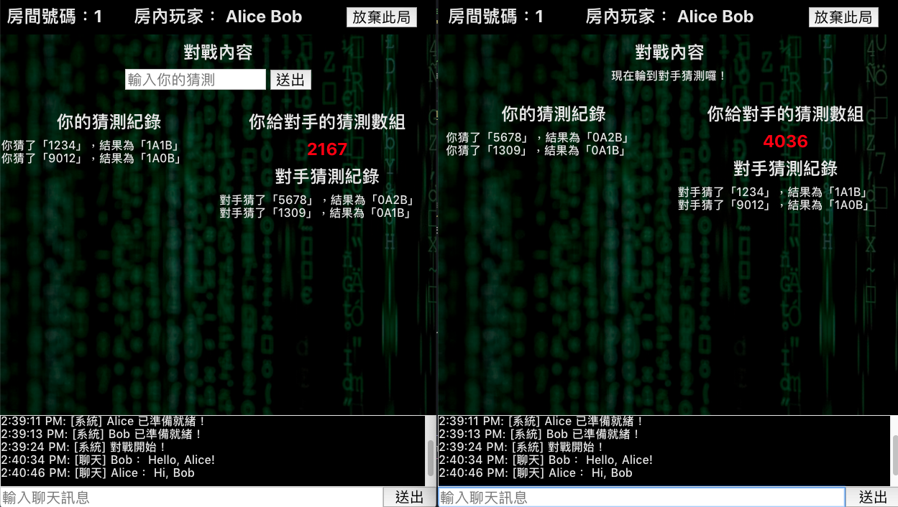

# WebSocket Game

> A experiment project about websocket based on Vue/Nuxt, Node.js/Express, and Socket.io.

## Demo




## Usage

### json-server

Used [json-server](https://github.com/typicode/json-server) as temporal data server.

```
json-server -p 4000 ./json-server/db.json
```

### Nuxt server

```
yarn
yarn dev
```

After setting up those steps above, you could login with fake user with account/password pair like "1/1".
